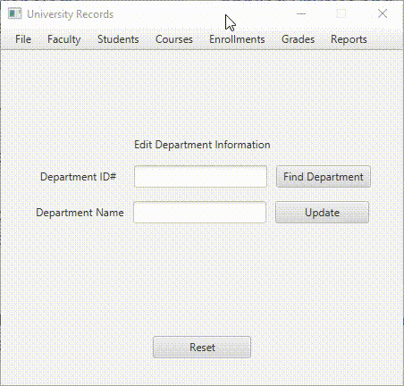

# University Records

An application built with the porpuse to manage grades/records for an university 
and apply what I have learned so far using Java

# How It's Made

#### Tech used: Java, JavaFX, MySQL Database/Server, SQL

This application allows user to create, read, update records that you tend to
see in an University. While using the app, the user is  allowed to add/edit
departments, instructors, courses, students, grades, and obtein reports.

* The UI was implemented using JavaFX which is a library that enables the creation
of user interfaces using Java.

* MySQL Database was used to store records. Mysql is an open-source relational
databse management system.

* MySQL Server was used to test the interaction between the application and
the database and that records where being stored properly.
(The concepts that I learned from using the server can be easily translatable 
to databases that are hosted in the cloud).

* SQL was used to create the schemas and also to query/fetch data from MySQL server.

